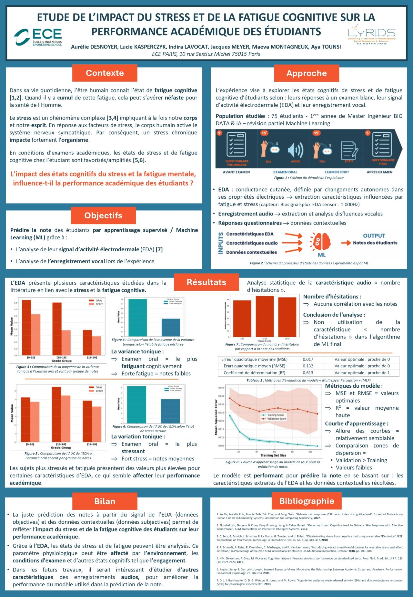

# Introduction 

This project investigates the impact of stress and cognitive fatigue on students’ academic performance using physiological and contextual data. By combining electrodermal activity (EDA) signals, audio features, and questionnaire data, we apply machine learning models to predict exam scores.

This work was carried out as my end-of-Master’s project and was awarded the Best Research Poster prize in 2025, highlighting the quality and relevance of the research.

## Poster

